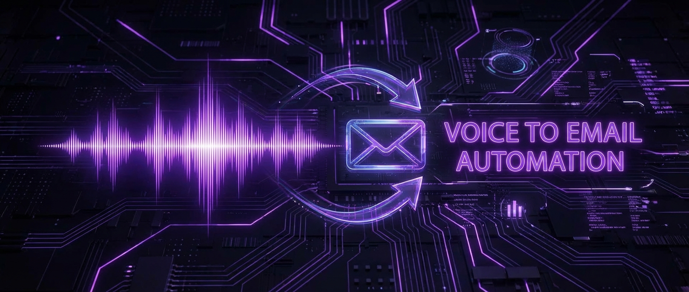

# automated-followups 📧 — Fireflies webhooks turn voice notes into instant thank-you emails.

<p align="center">
  
</p>

<p align="center">
  
  
  
  
  
</p>

Listens to Fireflies.ai webhooks for completed meeting transcripts, extracts key discussion points and action items, then auto-generates and sends personalized follow-up emails within minutes of a call ending. Integrates with voice memos for quick thank-you notes.

> **This is a closed-source project. The README documents the architecture and learnings.**

## What it does

- Receives Fireflies webhooks when meetings end
- Extracts key topics, action items, and commitments from transcripts
- Generates personalized follow-up emails using Claude
- Sends via AWS SES with proper threading (reply-to original invite)
- Voice memo mode: record a quick note, get a polished email
- Respects sending windows (no 11 PM follow-ups)

## How it works

```
Fireflies webhook fires
  → Transcript received
  → Claude extracts: attendees, key topics, action items, tone
  → Generates follow-up email matching my voice
  → Routes through AWS SES (DKIM signed)
  → Logs in CRM

Voice memo path:
  Audio → Whisper transcription → Same pipeline
```

## Tech stack

- **Runtime:** Node.js
- **AI:** Claude for extraction and drafting, Whisper for voice-to-text
- **Email:** AWS SES with DKIM signing
- **Integrations:** Fireflies.ai webhooks, Google Calendar
- **Database:** PostgreSQL for email log and deduplication

## What I learned

- Speed matters for follow-ups — sending within 5 minutes of a call ending makes a genuine impression
- The hardest part was tone calibration — a thank-you after an informational chat is different from a follow-up after a formal interview
- Deduplication is critical — webhook retries + multiple calendar events for the same meeting can trigger duplicate sends
